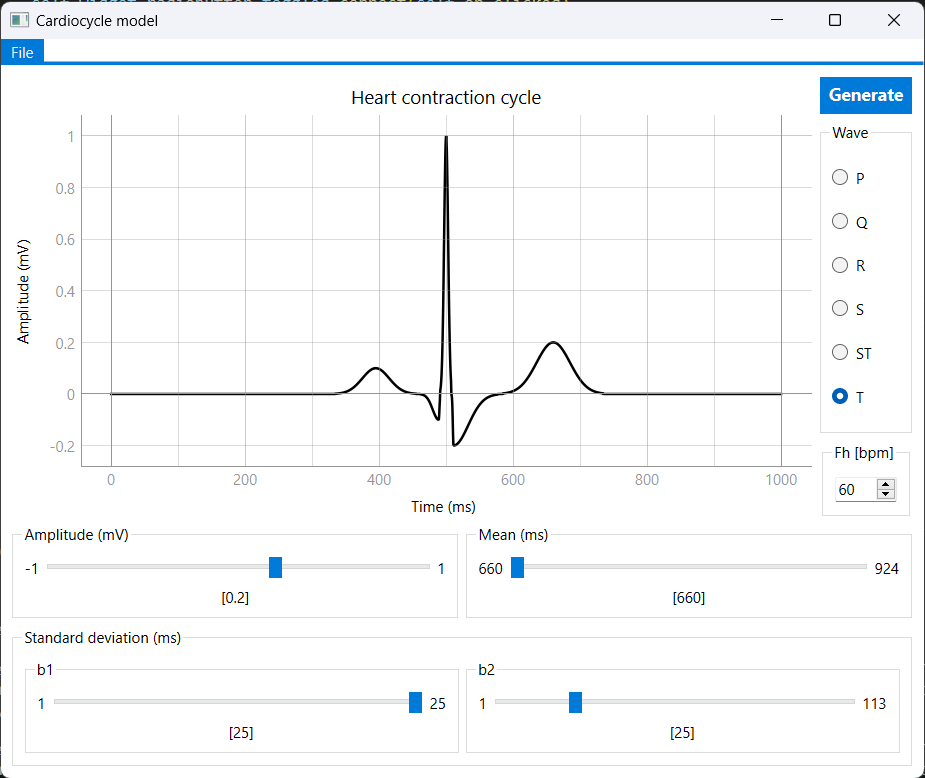
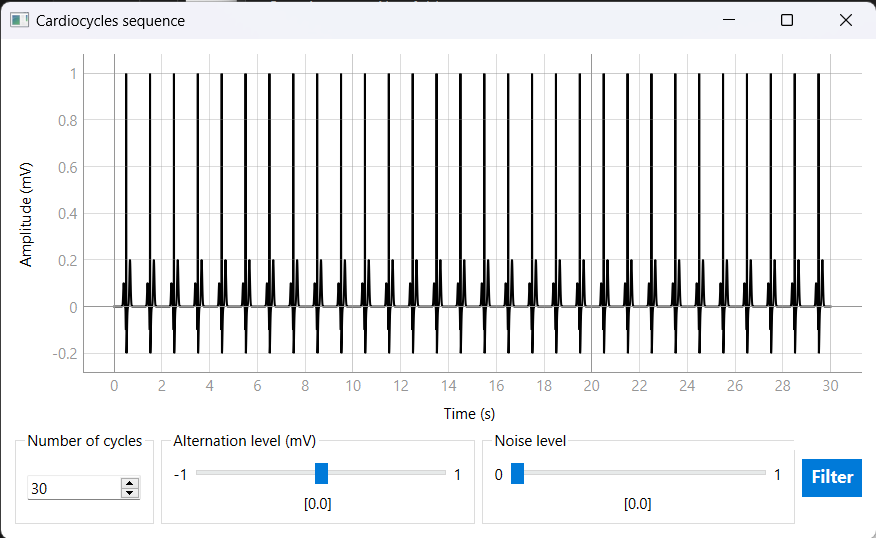
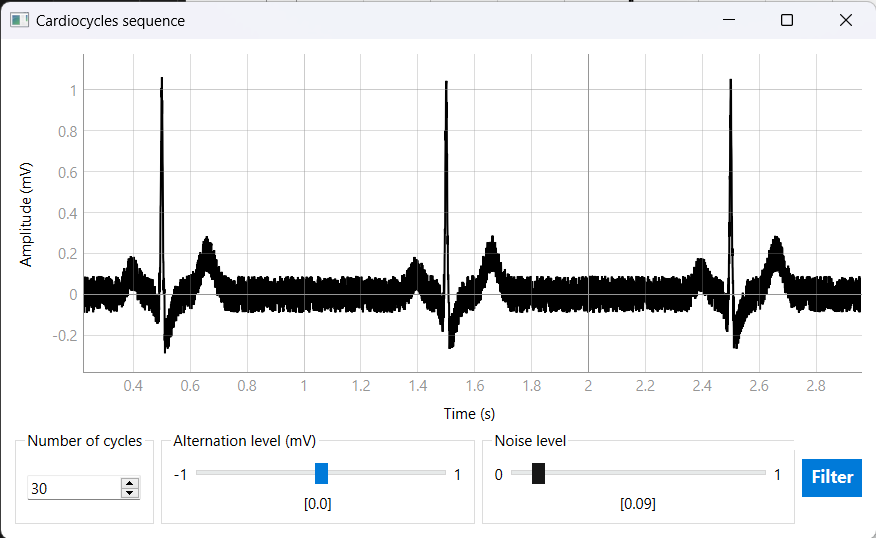
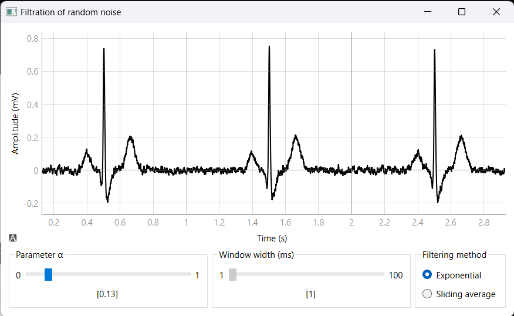
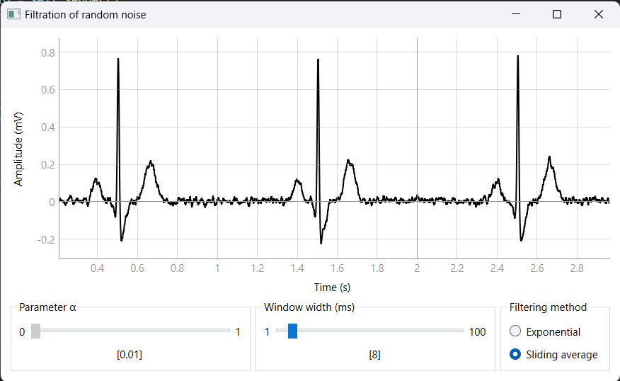
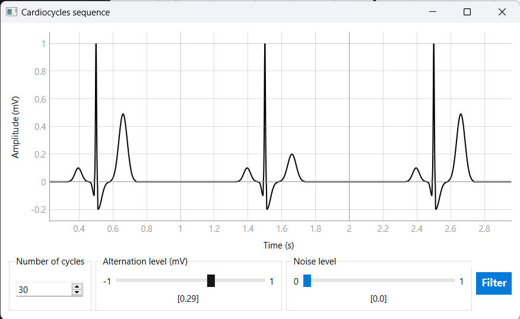
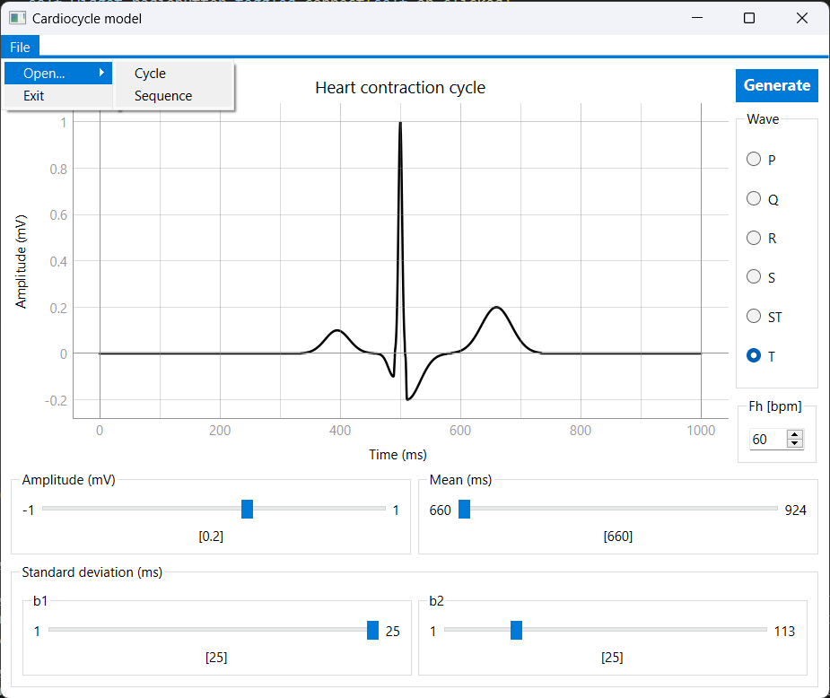
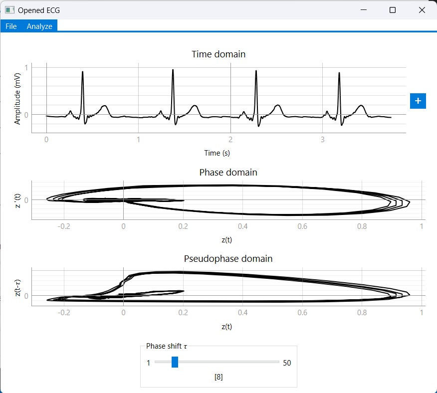
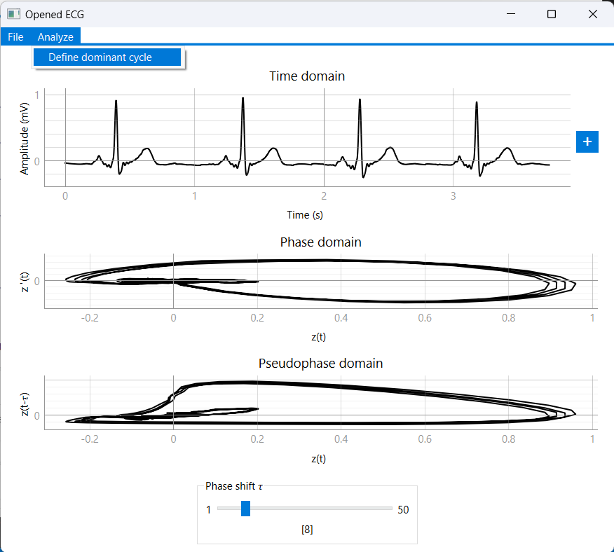
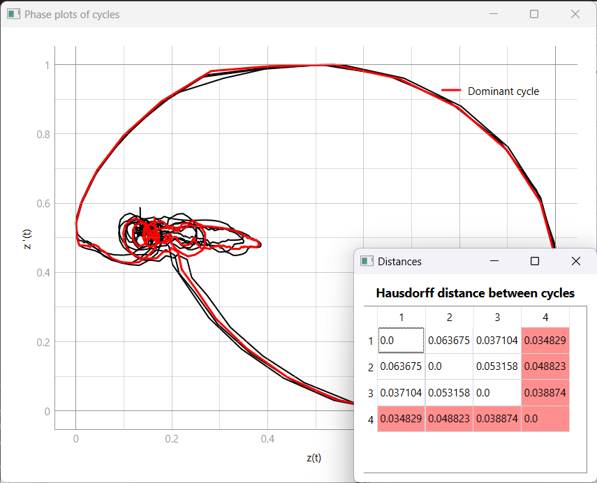

# Artificial ECG

## A project that lets you interact with artificially generated ECG signal

This project embraces such features and functions:
 - [construct ECG cycle](#construct-ecg-cycle--back-to-top-↑) (mean, standard deviation and amplitude of waves may be altered)
 - [generate ECG sequence from ECG cycle](#generate-ecg-sequence--back-to-top-↑) (30 by default, can be reduced or increased)
 - [add random noise to ECG sequence](#add-random-noise--back-to-top-↑) (uniform distribution)
 - [filter ECG sequence](#filter-ecg-sequence--back-to-top-↑) (exponential/sliding average)
 - [add alternation of T waves to ECG sequence](#add-alternation--back-to-top-↑)
 - [open ECG cycle/sequence from .txt file](#open-ecg--back-to-top-↑) (in case of opening a whole ECG sequence, defining dominant cycle option won't be available)
 - [plot ECG in time, phase and pseudophase domains](#plot-ecg--back-to-top-↑)
 - [define dominant cycle of ECG sequence](#define-dominant-cycle--back-to-top-↑) (pattern of ECG that is most prominently visible on the ECG tracing; the cycle that is the closest to all other cycles of ECG sequence based on Hausdorff distance)

[PyQtGraph](https://www.pyqtgraph.org/) was used for plotting ECG signals insead of Matplotlib for performance boosting and better integration with PyQt purposes. One can disable autoaliasing with `pg.setConfigOptions(antialias=False)` and achieve even faster interactive graphs experience. However, PyQtGraph uses some Matplotlib dependencies so you need to install it anyway.

## Previews

### Construct ECG cycle | [back to top ↑](#a-project-that-lets-you-interact-with-artificially-generated-ecg-signal)

### Generate ECG sequence | [back to top ↑](#a-project-that-lets-you-interact-with-artificially-generated-ecg-signal)

### Add random noise | [back to top ↑](#a-project-that-lets-you-interact-with-artificially-generated-ecg-signal)

### Filter ECG sequence | [back to top ↑](#a-project-that-lets-you-interact-with-artificially-generated-ecg-signal)

### Add alternation | [back to top ↑](#a-project-that-lets-you-interact-with-artificially-generated-ecg-signal)

 

### Open ECG | [back to top ↑](#a-project-that-lets-you-interact-with-artificially-generated-ecg-signal)

### Plot ECG | [back to top ↑](#a-project-that-lets-you-interact-with-artificially-generated-ecg-signal)

### Define dominant cycle | [back to top ↑](#a-project-that-lets-you-interact-with-artificially-generated-ecg-signal)

